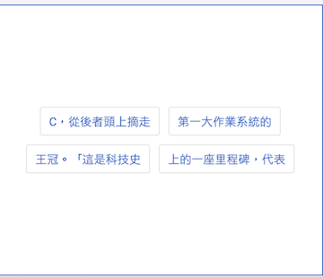
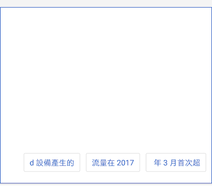

TaggingLayout
=============

 It's a FlowLayout with gravity for child views.

Snapshot
--------
+ Gravity is center



+ Gravity is bottom and right



Usage
-----
```xml
<com.ktt.toolkit.widget.TaggingLayout
    xmlns:android="http://schemas.android.com/apk/res/android"
    xmlns:app="http://schemas.android.com/apk/res-auto"
    android:layout_width="match_parent"
    android:layout_height="300dp"
    android:padding="10dp"
    app:childHorizontalSpacing="10dp"
    app:childVerticalSpacing="10dp"
    app:gravity="center"
    app:maxLine="2">

    <!-- your custom child views -->
    <TextView text="a" />
    <TextView text="b" />
    <TextView text="c" />
    <!-- your custom child views -->

</com.ktt.toolkit.widget.TaggingLayout>
```

Properties
----------
+ **gravity** : specify the gravity of child views
  - value: left, right, top, bottom, center, center_horizontal, center_vertical
+ **maxLine** : specify the max lines of child views
+ **childVerticalSpacing**
+ **childHorizontalSpacing**
